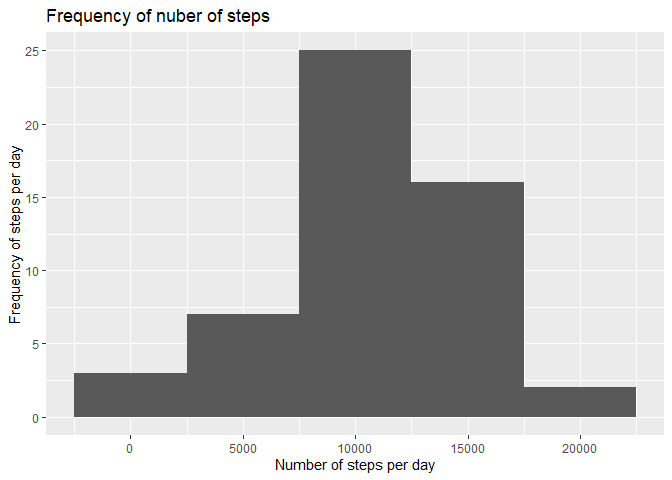
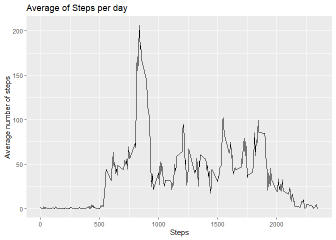
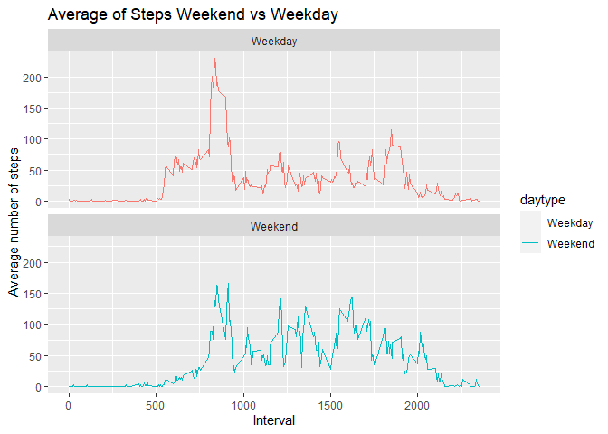

## Loading and preprocessing the data

```r
#Import data from repository
library(dplyr)
```

```
## 
## Attaching package: 'dplyr'
```

```
## The following objects are masked from 'package:stats':
## 
##     filter, lag
```

```
## The following objects are masked from 'package:base':
## 
##     intersect, setdiff, setequal, union
```

```r
library(tidyr)
library(ggplot2)
library(lubridate)
```

```
## 
## Attaching package: 'lubridate'
```

```
## The following objects are masked from 'package:base':
## 
##     date, intersect, setdiff, union
```

```r
activity <- read.csv("C:/Users/Guillermo Polanco/Documents/RepData_PeerAssessment1/activity.csv")
activity <- as_tibble(activity)

#Turn date variable into date format and day of week

activity$wkday <- wday(ymd(activity$date),label=TRUE)

act_sum <- aggregate(steps ~ date, activity, sum, na.rm=TRUE)

#Timeseries data

act_time <- group_by(activity, interval)
act.time.avg <-summarize(act_time, steps=mean(steps, na.rm = TRUE))
act.time.avg <- act.time.avg[!is.na(act.time.avg$steps),]
act.time.avg
```

```
## # A tibble: 288 x 2
##    interval  steps
##       <int>  <dbl>
##  1        0 1.72  
##  2        5 0.340 
##  3       10 0.132 
##  4       15 0.151 
##  5       20 0.0755
##  6       25 2.09  
##  7       30 0.528 
##  8       35 0.868 
##  9       40 0     
## 10       45 1.47  
## # ... with 278 more rows
```


## What is frequency of total steps taken per day?

```r
#Plot frequency of steps 

ggplot(data=act_sum, aes(steps))+
  geom_histogram(binwidth=5000)+
  xlab("Number of steps per day")+
  ylab("Frequency of steps per day")+
  ggtitle("Frequency of nuber of steps")
```

<!-- -->

```r
#Get mean and median
mean(act_sum$steps)
```

```
## [1] 10766.19
```

```r
median(act_sum$steps)
```

```
## [1] 10765
```


## What is the average daily activity pattern?

```r
ggplot(act.time.avg, aes(interval, steps))+ #Yes! it works
  geom_line()+
  xlab("Steps")+
  ylab("Average number of steps")+
  ggtitle("Average of Steps per day")
```

<!-- -->


## Imputing missing values

```r
#Calculating rows where NAs
sum(!complete.cases(activity))
```

```
## [1] 2304
```

```r
#Separate NA vs not, calculate the average steps per interval to replace NAs

activity.na <- activity[is.na(activity$steps),]
activity.non.na2 <- activity[!is.na(activity$steps),]
activity.non.na <- activity[!is.na(activity$steps),] %>%
  group_by(interval) %>%
  summarize(steps=mean(steps))

activity.na.merged <- left_join(activity.na, activity.non.na, by= c("interval" = "interval")) %>%
  select(date,interval, steps.y,wkday) %>%
  rename(steps = steps.y)

#merge two datasets, NA and non-NA into one

activity.repl <- rbind(activity.non.na2,activity.na.merged)
activity.repl
```

```
## # A tibble: 17,568 x 4
##    steps date       interval wkday
##    <dbl> <chr>         <int> <ord>
##  1     0 2012-10-02        0 Tue  
##  2     0 2012-10-02        5 Tue  
##  3     0 2012-10-02       10 Tue  
##  4     0 2012-10-02       15 Tue  
##  5     0 2012-10-02       20 Tue  
##  6     0 2012-10-02       25 Tue  
##  7     0 2012-10-02       30 Tue  
##  8     0 2012-10-02       35 Tue  
##  9     0 2012-10-02       40 Tue  
## 10     0 2012-10-02       45 Tue  
## # ... with 17,558 more rows
```

```r
#prepare data for charting
#Turn date variable into date format and day of week

activity.repl$wkday <- wday(ymd(activity.repl$date),label=TRUE)

act.repl.sum <- aggregate(steps ~ date, activity, sum, na.rm=TRUE)

#Plot sum of steps 


ggplot(data=act.repl.sum, aes(steps))+
  geom_histogram(binwidth=5000)+
  xlab("Number of steps per day")+
  ylab("Frequency of steps per day")+
  ggtitle("Frequency of nuber of steps")
```

<!-- -->

```r
#Get mean and median
mean(act.repl.sum$steps)
```

```
## [1] 10766.19
```

```r
median(act.repl.sum$steps)
```

```
## [1] 10765
```


## Are there differences in activity patterns between weekdays and weekends?

Overall, the average number of steps during the weekend is more consistent when compared with the weekday, which has a high peak.

```r
#Data for weekday vs weekend comparison
activity.repl <-activity.repl %>%
  mutate(daytype=if_else(activity.repl$wkday == "Sun", "Weekend",
                         if_else(activity.repl$wkday == "Sat","Weekend", "Weekday"),
                         "Weekday"))
                  
#Line plot 2x2
act.repl.time.avg <- aggregate(steps~interval + daytype, data=activity.repl, FUN="mean")


ggplot(act.repl.time.avg, aes(interval, steps, color=daytype))+ #Yes! it works
  geom_line()+
  facet_wrap(~daytype, ncol=1, nrow=2) +
  xlab("Interval")+
  ylab("Average number of steps")+
  ggtitle("Average of Steps Weekend vs Weekday")
```

<!-- -->

##Addedum: Highest step count frequency is:
This is refering to the timeplot, it shows the highest frequency at around the 1000 steps mark
